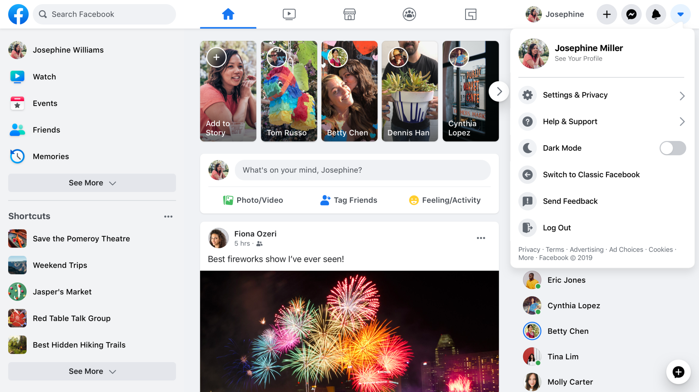
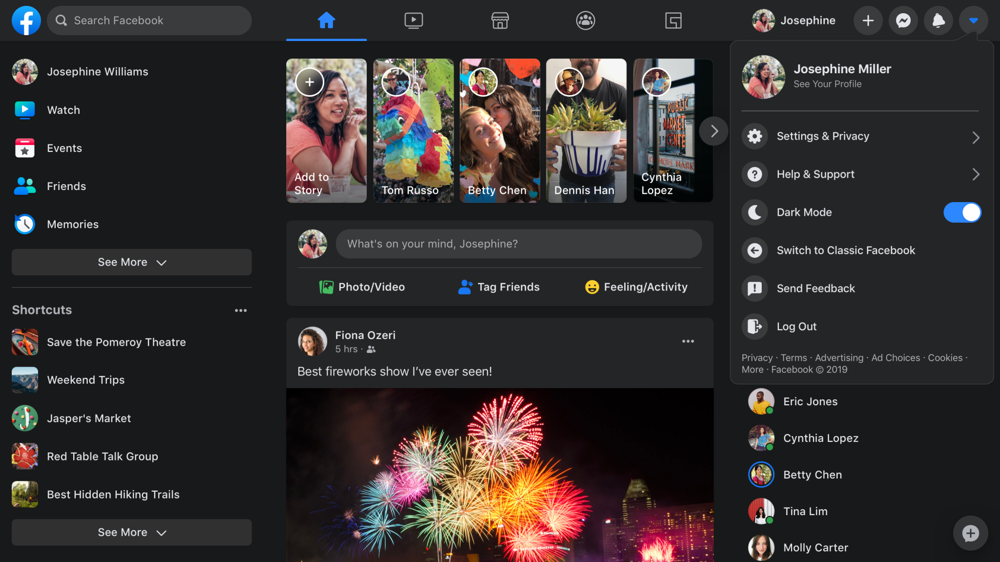
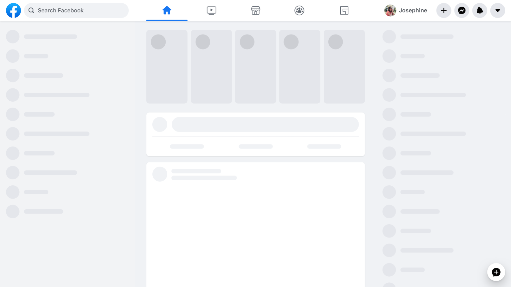
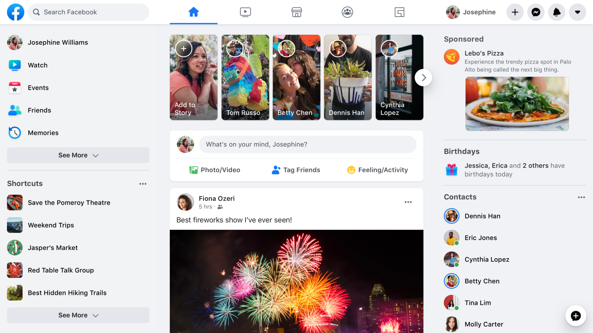
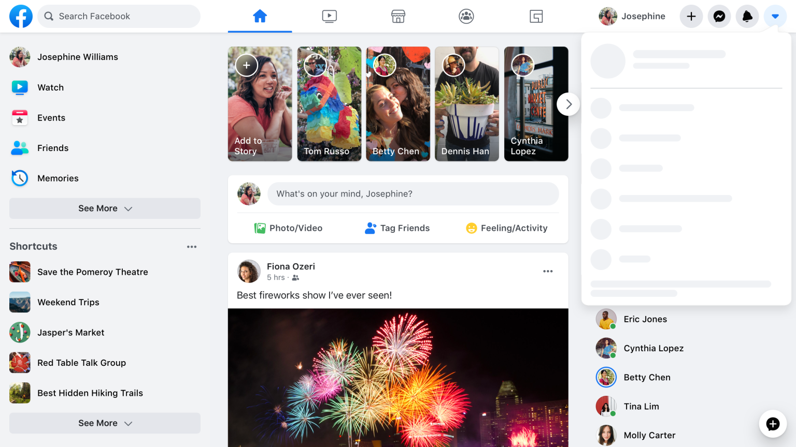
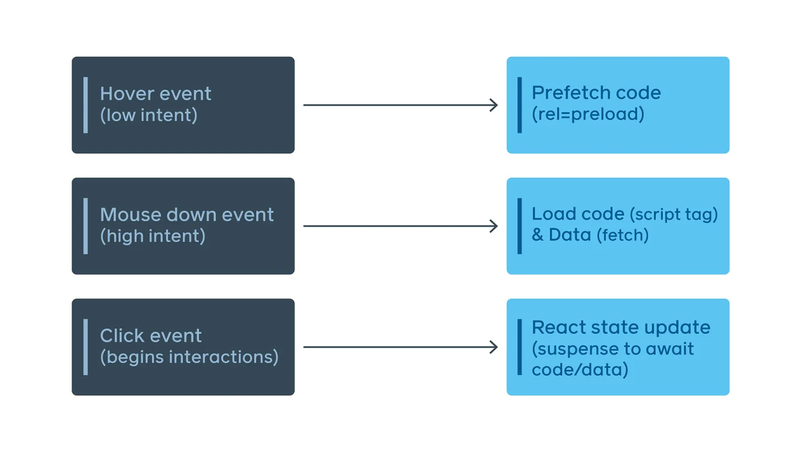
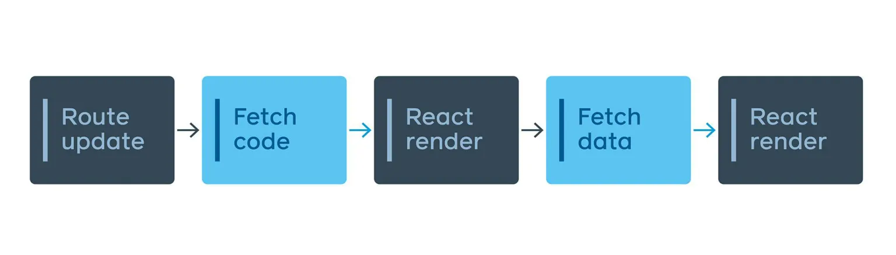
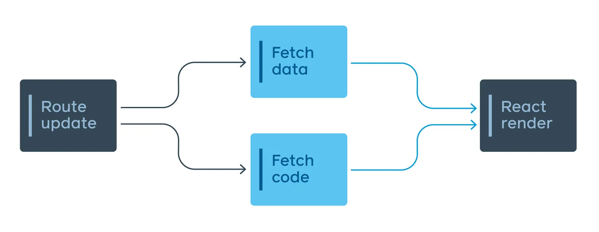
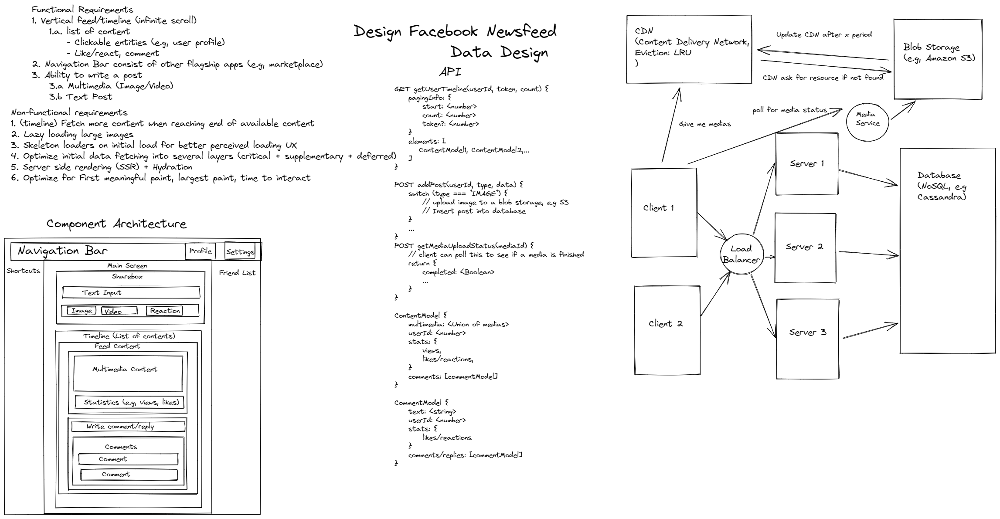

以下是对 [Rebuilding our tech stack for the new Facebook.com](https://engineering.fb.com/2020/05/08/web/facebook-redesign/)的翻译

Facebook.com 在2004年作为一个简单的，服务端渲染的PHP网页推出。随着时间的推移，我们不断添加新技术、新的处理层来提供更多的互动功能。这些新功能和技术都会逐步地降低网站的速度，并使其更难维护。这使得引入新的功能变得更为困难。诸如暗黑模式和在动态消息中保存设置等功能都没有直接的技术实现。所以，我们需要退一步，开始重新思考我们的架构。

当我们思考如何构建一个新的Web应用——一个专为当今的浏览器设计、具有人们期望能在Facebook体验的功能的应用时，我们意识到我们目前的技术栈没有办法支持这个应用的体验和性能。一个完全的重构是比较罕见的，但是在我们目前的讨论中，因为过去十年中Web相关技术发生了巨大的变化，只有完全的重构我们才能够达到我们的要求，也就是出色的性能、可维护性和可扩展性。本次，我们将分享在重新架构 Facebook.com 时使用 React（一个用于构建UI的声明式JS库）和Relay（React的GraphQL客户端）所学会的经验。

## 准备工作

我们深知Facebook必须实现快速启动、快速响应并且提供高度可互动的用户体验。尽管服务器驱动的应用可以提供较快的启动时间，但我们不确定能否使其像客户端驱动应用一样可以提供令人愉悦的丰富互动。然而，我们相信我们可以通过构建一个客户端驱动应用实现相对有竞争力的启动速度。

但从零开始构建客户端优先的应用带来了一系列新问题。我们需要快速重建技术栈，同时解决速度和其他用户体验问题，并且要确保这一方案是能够保有多年的可维护和可扩展性。

在整个过程中，我们始终围绕两个技术原则展开工作：

1. **尽可能少，尽可能早**：只提供必要的资源，并努力让它们在需要之前及时到达。
2. **以用户体验为导向的工程实践**：我们开发的最终目标是为网站用户服务。在思考网站的用户体验挑战时，我们可以调整开发体验，引导工程师默认做出正确的选择。

我们将这些原则应用于网站的四个主要方面：CSS、JavaScript、数据和导航。


## 重新思考CSS，解锁新能力

首先，我们通过改变样式的编写和构建方式，将主页的CSS减少了80%。在新网站中，我们编写的CSS与最终发送到浏览器的内容不同。虽然我们在组件文件中编写类似CSS的JavaScript代码，但构建工具会将这些样式拆分为独立的优化包。因此，新网站传输的CSS更少，支持深色模式和动态字体大小以提高可访问性，并改善了图像渲染性能，同时让工程师更易于开发。


### 通过原子CSS将主页CSS减少80%

在旧版网站中，加载主页时需要加载超过400 KB的压缩CSS（未压缩时为2 MB），但其中只有10%用于初始渲染。我们最初并没有这么多CSS，但随着时间推移，它只增不减。部分原因在于每个新功能都意味着添加新的CSS。

我们通过在构建时生成原子CSS来解决这个问题。原子CSS的增长曲线是对数型的，因为它与唯一样式声明的数量成正比，而不是与我们编写的样式和功能数量成正比。这使得我们可以将整个网站生成的原子CSS合并为一个单一、小巧的共享样式表。最终，新版主页下载的CSS不到旧版网站的20%。

### 通过样式共置减少未使用的CSS并提高可维护性

CSS随时间增长的另一个原因是难以确定某些CSS规则是否仍在使用。原子CSS有助于减轻性能影响，但独特的样式仍会添加不必要的字节，而源代码中未使用的CSS会增加工程开销。现在，我们将样式与组件共置，以便可以同时删除它们，并在构建时将它们拆分为独立的包。

我们还解决了另一个问题：CSS的优先级取决于顺序，这在使用的自动化打包工具可能随时间变化时尤其难以管理。以前，一个文件的更改可能会破坏另一个文件的样式，而作者可能没有意识到。现在，我们使用受[React Native](https://reactnative.dev/)样式API启发的熟悉的语法编写样式：我们保证样式以稳定的顺序应用，并且不支持CSS后代选择器。

### 调整字体大小以提高可访问性

我们还利用离线构建步骤进行了可访问性改进。如今，许多用户通过浏览器缩放功能来放大文本，但这可能会意外触发平板或移动布局，或者放大不需要放大的内容（如图像）。

通过使用`rem`单位，我们可以允许用户指定的默认设置，并提供自定义字体大小的控件，而无需更改样式表。然而，设计通常使用CSS像素值创建。手动转换为`rem`会增加工程开销和潜在错误，因此我们让构建工具为我们完成这一转换。

### 编译时处理示例

```js
const styles = stylex.create({
  emphasis: {
    fontWeight: 'bold',
  },
  text: {
    fontSize: '16px',
    fontWeight: 'normal',
  },
});
 
function MyComponent(props) {
  return <span className={styles('text', props.isEmphasized && 'emphasis')} />;
}
```
_Example of source code._

```css
.c0 { font-weight: bold; }
.c1 { font-weight: normal; }
.c2 { font-size: 0.9rem; }
```

_Example of generated CSS._

```javascript
function MyComponent(props) {
  return <span className={(props.isEmphasized ? 'c0 ' : 'c1 ') + 'c2 '} />;
}
```

_Example of generated JavaScript._


### 主题中的CSS变量（暗黑模式）

在旧网站上，我们曾经尝试通过向 body 元素添加类名来应用主题，然后使用该类名以具有更高特异性的规则覆盖现有样式。这种方法是有问题的，它不再适用于我们新的原子化的 CSS-in-JavaScript 方法，因此我们切换到了使用 CSS 变量来实现主题化。

CSS 变量在CSS类下定义，当这个类应用于 DOM 元素时，其值将应用于其 DOM 子树内的样式。这允许我们在单个样式表中组合主题样式，也就是切换不同的主题并不需要重新加载页面，不同页面也能在不下载额外的CSS文件的情况下就应用不同的主题，并且不同的产品也可以在同一页面并排使用不同的主题。

```css
.light-theme {
  --card-bg: #eee;
}
.dark-theme {
  --card-bg: #111;
}
.card {
  background-color: var(--card-bg);
}
```

这使得主题的性能影响与调色板的大小成正比，而不是与组件库的大小或复杂性成正比。单个原子 CSS 包也包含暗黑模式的实现。


## 在JavaScript中使用SVG实现快速、单次渲染性能

为防止图标在其他内容后加载而导致出现闪烁，我们使用React将SVG内联到HTML中，而不是将SVG文件传递给``标签。由于这些SVG现在实际上是JavaScript，它们可以与周围的组件一起打包和传递，从而实现干净的单次渲染。我们发现，与SVG绘制性能的成本相比，以JS代码形式同时加载这些内容的好处更大。通过内联，不会有图标渲染滞后造成的闪烁现象。

```javascript
function MyIcon(props) {
  return (
    <svg {...props} className={styles({/*...*/})}>
       <path d="M17.5 ... 25.479Z" />
    </svg>
  );
}
```

此外，这些图标可以在运行时平滑更改颜色，而无需额外下载。我们能够根据其props对图标进行样式设置，并使用CSS变量为主题化某些类型的图标，尤其是单色图标。





## JS代码分割以提高性能

代码大小是基于JavaScript的单页应用最大的关注点之一，因为它对页面加载性能有很大影响。我们知道，如果我们想要为Facebook.com构建一个客户端React应用，就需要解决这个问题。我们引入了几个新的API，与我们的“尽可能少，尽可能早”原则保持一致。

### 增量代码下载，只下载所需内容

当用户等待页面加载时，我们的目标是通过渲染页面的UI“骨架”来提供即时反馈。这个骨架需要最少的资源，但如果我们的代码打包在单个包中，就无法提前渲染它，因此我们需要根据页面显示的顺序进行代码分割。然而，如果我们简单地这样做（例如，通过在渲染期间获取[动态导入](https://github.com/tc39/proposal-dynamic-import)），可能会损害性能而不是改善它。这是我们JavaScript加载层级代码分割设计的基础：我们使用声明式、可静态分析的API将初始加载所需的JavaScript分为三个层级。

**层级1**：显示首屏内容首次绘制所需的基本布局，包括初始加载状态的UI骨架。  


*层级1代码渲染后*


```javascript
import ModuleA from 'ModuleA';
```
_层级1通常使用 import 语法_


**层级2**：包括完全渲染所有首屏内容所需的所有JavaScript。在层级2之后，屏幕上不应再因代码加载而发生视觉变化。  


*层级2代码渲染后*

```javascript
importForDisplay ModuleBDeferred from 'ModuleB';
```

一旦遇到`importForDisplay`，它及其依赖项将被移至层级2。这会返回一个基于Promise的包装器，用于在模块加载后访问它。


*层级2需要是完全可交互的。当用户点击了一个已经被层级2渲染后的菜单时，需要能够马上给出这个操作的反馈，即使相关内容还没有准备好渲染*


**层级3**：包括所有仅在显示后需要且不影响当前屏幕像素的内容，例如日志代码和实时更新数据的订阅。  

```javascript
importForAfterDisplay ModuleCDeferred from 'ModuleC';
 
// ...
 
function onClick(e) {
  ModuleCDeferred.onReady(ModuleC => {
    ModuleC.log('Click happened! ', e);
  });
}
```
*一旦遇到  `importForAfterDisplay`，它及其依赖项将被移至层级3。这会返回一个基于Promise的包装器，用于在模块加载后访问它。*

一个500 KB的JavaScript页面可以变为层级1的50 KB、层级2的150 KB和层级3的300 KB。通过这种方式分割代码，我们可以减少达到每个里程碑所需的代码下载量，从而改善首次绘制时间和视觉完成时间。由于层级3不影响屏幕像素，它并不是真正渲染相关的，最终绘制会更早完成。最重要的是，加载页能够更早渲染。

### 仅在需要时交付实验驱动的依赖项

我们经常需要渲染同一UI的两个变体，例如在A/B测试中。最简单的方法是为所有用户下载两个版本，但这意味着我们经常下载从未执行的代码。稍好的方法是在渲染时使用动态导入，但性能并不好。

相反，为了遵循我们的“尽可能少，尽可能早”的原则，我们构建了一个声明式API，提前提醒我们这些决策，并将它们编码到依赖图中。在页面加载时，服务器能够检查实验并仅发送所需版本的代码。

```javascript
const Composer = importCond('NewComposerExperiment', {
  true: 'NewComposer',
  false: 'OldComposer',
});
```

这在拆分条件在页面加载期间是静态的情况下（例如A/B测试、区域设置或设备类别）效果很好。

### 仅在需要时交付数据驱动的依赖项

那么，在页面加载期间不是静态的代码分支呢？例如，为News Feed帖子的所有不同类型和组合发送所有渲染代码会显著增加页面的JavaScript大小。

这些依赖项在运行时根据后端返回的数据决定。这使我们能够使用[Relay](https://github.com/facebook/relay)的新功能来表达需要哪种渲染代码，具体取决于返回的数据类型。如果帖子有特殊附件（例如照片），我们会描述需要`PhotoComponent`来渲染该照片。

```javascript
... on Post {
  ... on PhotoPost {
    @module('PhotoComponent.js')
    photo_data
  }
  ... on VideoPost {
    @module('VideoComponent.js')
    video_data
  }
}
```
*我们将渲染每种帖子类型所需的依赖项作为查询的一部分。*

更好的是，`PhotoComponent`本身精确地以片段的形式描述了照片附件类型上需要的数据，这意味着我们甚至可以拆分查询逻辑。

### 使用JavaScript预算防止代码膨胀

层级和条件依赖帮助我们仅为每个阶段提供必要的代码，但我们还需要确保每个层级的大小随时间保持可控。为了管理这一点，我们引入了按产品的JavaScript预算。

我们根据性能目标、技术约束和产品考虑设置预算。我们分配页面级预算，并根据产品和团队边界细分页面。共享基础设施被添加到一个精心策划的列表中，并拥有自己的预算。共享基础设施计入所有页面的预算，但产品团队可以免费使用其中的模块。我们还有延迟加载、条件加载或交互加载代码的预算。

我们为流程的每个步骤创建了额外的工具：

- 依赖图工具，使理解代码来源和发现减少代码大小的机会变得更加容易。
- 合并请求的尺寸监控，显示尺寸回归/改进，并触发可自定义的警报。
- 交互式图表，显示历史尺寸以及版本之间的变化。
- 仪表板，帮助我们理解当前尺寸状态与预算的联系。


## 现代化数据获取——尽早获取数据

作为此次重构的一部分，我们现代化了Web上的数据获取基础设施。虽然旧版网站的某些功能使用Relay和[GraphQL](https://graphql.org/)进行数据获取，但大多数功能在服务器端PHP渲染过程中临时获取数据。通过新版网站，我们能够与app达成统一标准，并确保所有数据获取都通过GraphQL进行。由于Relay和GraphQL已经为我们处理了“尽可能少”的工作，我们只需要进行一些更改以支持尽早获取所需数据。

### 在初始服务器请求上预加载数据以改善启动

许多Web应用需要等待所有JavaScript下载并执行后才能从服务器获取数据。使用Relay，我们静态地知道页面需要什么数据。这意味着一旦我们的服务器收到页面请求，它可以立即开始准备必要的数据，并与所需代码并行下载。我们在数据可用时将其与页面流式传输，以便客户端可以避免额外的往返并更快地渲染最终页面内容。

### 流式传输数据以减少往返次数并提高交互性

在Facebook.com的初始加载过程中，某些内容可能最初被隐藏或渲染在视口之外。例如，大多数屏幕适合一个或两个News Feed帖子，但我们事先不知道会适合多少个。此外，用户很可能会滚动，而逐个获取每个Story需要时间。另一方面，我们在一个查询中获取的Story越多，该查询就越慢，这会导致查询时间更长，甚至第一个Story的渲染完成时间也更长。

为了解决这个问题，我们使用内部的GraphQL扩展`@stream`，将Feed连接流式传输到客户端，用于初始加载和滚动时的后续分页。这使我们能够在每个Feed Story准备好时立即发送，一次一个，只需一个查询操作。

```javascript
fragment HomepageData on User {
  newsFeed(first: 10) {
    edges @stream
  }
  ...AdditionalData
}
```

### 延迟不需要立即使用的数据

某些查询的不同部分计算时间比其他部分长。例如，在查看个人资料时，获取用户的姓名和个人资料照片相对较快，但获取其Timeline的内容需要更长的时间。

为了通过单个查询获取这两种类型的数据，我们使用`@defer`，它使响应的不同部分在准备好时立即流式传输。这使我们能够尽快用初始数据渲染大部分UI，并为其余部分渲染加载状态。使用[React Suspense](https://17.reactjs.org/docs/concurrent-mode-suspense.html)，这更加容易，因为我们可以显式地设计加载状态，以确保平滑、自顶向下的页面加载体验。

```javascript
fragment ProfileData on User {
  name
  profile_picture { ... }
  ...AdditionalData @defer
}
```

## 路由映射和定义以实现更快导航

快速导航是单页应用的一个重要特性。当导航到新路由时，我们需要从服务器获取各种代码和数据以渲染目标页面。为了减少加载新页面时所需的网络往返次数，客户端需要提前知道每个路由需要哪些资源。我们称之为路由映射，每个条目称为路由定义。

### 尽早获取路由定义

对于Facebook，这个路由映射太大，无法一次性发送。所以，当新的链接被渲染，我们在会话期间动态地向路由映射添加路由定义。路由映射和路由位于应用的最高层，允许当前应用和路由状态的组合驱动应用级状态决策，例如基于当前路由的顶部导航栏或聊天选项卡的行为。

### 尽早预加载资源

客户端应用通常等待页面由React渲染时才下载该页面所需的代码和数据。这通常使用`React.lazy`或类似的语句完成。由于这可能会使页面导航变慢，所以我们在链接被点击之前就启动对一些必要资源的首次请求：



_我们提前启动获取，在悬停或聚焦时预加载，并在鼠标按下时获取。此示例特定于桌面，但其他启发式方法可用于触摸设备。_

为了提供比仅显示空白屏幕更流畅的导航体验，我们使用[React Suspense transitions](https://17.reactjs.org/docs/concurrent-mode-patterns.html#transitions)继续渲染先前路由，直到下一个路由完全渲染或暂停到“良好”加载状态，并显示下一页的UI骨架。这更加不那么突兀，并且模仿了标准浏览器行为。

### 并行化代码和数据下载

我们在新网站上进行了大量代码的[懒加载](https://developer.mozilla.org/en-US/docs/Web/Performance/Guides/Lazy_loading)，但如果我们懒加载路由的代码，并且该路由的数据获取代码位于该代码内部，我们最终会得到串行加载。


_具有懒加载路由的“传统”React/Relay应用会导致两次往返。_

为了解决这个问题，我们提出了EntryPoints，它们是包装代码分割点并将输入转换为查询的文件。这些文件非常小，并为任何可到达的代码分割点提前下载。


_代码和数据并行获取，使我们能够在单次网络往返中下载这些。_

GraphQL查询仍然与视图共置，但EntryPoint封装了何时需要该查询以及如何将输入转换为正确的变量。应用使用这些EntryPoint自动决定何时获取资源，确保默认情况下发生正确的事情。这还有一个额外的好处，即创建一个包含应用中任何给定点的所有数据获取需求的单个JavaScript函数，可用于前面讨论的服务器预加载。


我们在这里讨论的许多更改并非Facebook特有。这些概念和模式可以应用于使用任何框架或库的任何客户端应用。通过标准化我们的技术栈，我们能够重新思考如何以高性能、可持续的方式引入人们想要的功能——即使我们在工程和产品规模上运营。

工程体验改进和用户体验改进必须齐头并进，性能和可访问性不能被视为功能交付的负担。通过出色的API、工具和自动化，我们可以帮助工程师更快地移动，同时交付更好、更高性能的代码。为新版Facebook.com改善性能的工作是广泛的，我们预计很快会分享更多关于这项工作的信息。要查看重新设计，请访问[facebook.com/new](https://www.facebook.com/)。它正在逐步推出，并很快将对所有人可用。


> 以下图片并非来自原文，来自于[https://imgur.com/a/o6EDTwr](https://imgur.com/a/o6EDTwr)，模拟在面试中碰到这个题目时的思路



